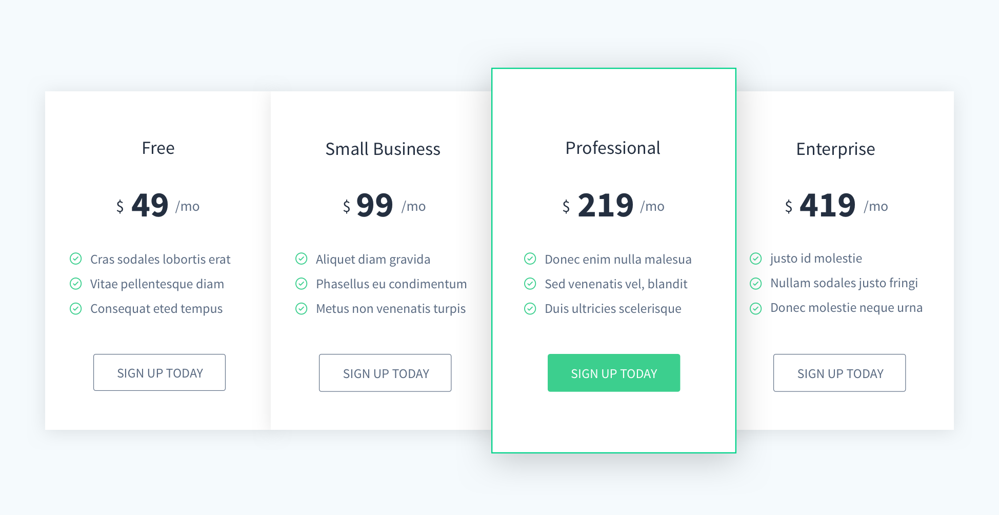
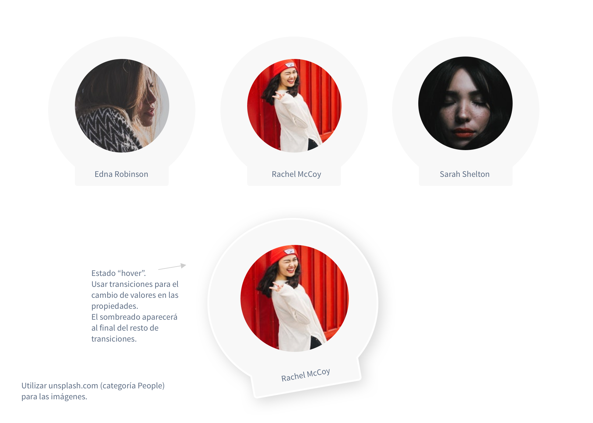

# Transformaciones y transiciones

## Precios

En esta tabla de precios se requiere aplicar un cambio de aspecto cuando se pasa el ratón por encima de uno de los planes de precio. Se aplicará una transición para que dicho cambio sea gradual.

## Perfiles

Al igual que en la imagen anterior, cambiar el aspecto del perfil cuando el ratón pasa por encima del mismo. Se requiere el uso de transiciones considerando que el sombreado aparecerá al final del resto.

Fuente para las imágenes: [https://unsplash.com/t/people](https://unsplash.com/t/people)

